# 📖 Introduction

## 🌟 What is ACTA API?

The **ACTA API** (Autonomous Credential Trust Architecture) is a comprehensive REST API designed to manage verifiable credentials on the Stellar blockchain. It provides a secure, scalable, and decentralized solution for creating, storing, and verifying digital credentials using Soroban smart contracts.

### 🎯 **Mission Statement**
*Empowering trust through decentralized credential management on the Stellar blockchain*

---

## 🏗️ System Architecture

### Modern, microservices-inspired architecture built on Stellar

```mermaid
graph LR
    A[👥 Client Applications] --> B[🔒 ACTA API]
    B --> C[⭐ Stellar Network]
    
    subgraph "Client Layer"
        A1[🌐 Web Apps]
        A2[📱 Mobile Apps]
        A3[🔗 dApps]
    end
    
    subgraph "API Gateway"
        B1[🌐 REST Endpoints]
        B2[🔧 Business Logic]
        B3[✅ Validation]
    end
    
    subgraph "Blockchain Layer"
        C1[🌟 Horizon API]
        C2[🤖 Soroban RPC]
        C3[📜 Smart Contracts]
    end
```

### 🔧 **Core Components**

| Layer | Component | Description |
|-------|-----------|-------------|
| **🌐 API** | Express.js Server | High-performance Node.js web server |
| **⭐ Blockchain** | Stellar SDK Integration | Direct integration with Stellar blockchain |
| **🤖 Smart Contracts** | Soroban Contracts | Business logic execution on-chain |
| **🛡️ Security** | CORS & Helmet | Cross-origin protection and security headers |
| **📝 Language** | TypeScript | Type-safe development environment |

## Key Features

### 🔐 Verifiable Credentials
- Create tamper-proof digital credentials
- Store credentials immutably on Stellar blockchain
- Verify credential authenticity and integrity
- Support for various credential types and schemas

### 🌐 Stellar Integration
- **Multi-network Support**: Works with both Testnet and Mainnet
- **Account Management**: Automatic Stellar account validation
- **Transaction Handling**: Robust transaction submission and monitoring
- **Fee Management**: Optimized fee calculation and handling

### 🔒 Security Features
- **CORS Protection**: Configurable cross-origin resource sharing
- **Security Headers**: Comprehensive HTTP security headers
- **Input Validation**: Strict validation of all inputs
- **Error Handling**: Secure error messages without information leakage

### ⚡ Performance
- **Async Operations**: Non-blocking I/O operations
- **Connection Pooling**: Efficient Stellar network connections
- **Caching**: Smart caching of blockchain data
- **Rate Limiting**: Built-in protection against abuse

## Use Cases

### Educational Institutions
- **Digital Diplomas**: Issue tamper-proof academic credentials
- **Certification Programs**: Manage professional certifications
- **Student Records**: Maintain verifiable academic transcripts

### Corporate Environment
- **Employee Credentials**: Issue and manage employee certifications
- **Training Certificates**: Track and verify completed training programs
- **Professional Licenses**: Manage regulatory compliance credentials

### Healthcare
- **Medical Licenses**: Verify healthcare professional credentials
- **Patient Records**: Secure and verifiable medical history
- **Vaccination Certificates**: COVID-19 and other vaccination proofs

### Government Services
- **Identity Documents**: Digital identity verification
- **Permits and Licenses**: Business and professional permits
- **Compliance Certificates**: Regulatory compliance documentation

## Technology Stack

### Backend Technologies
- **Node.js**: JavaScript runtime environment
- **Express.js**: Web application framework
- **TypeScript**: Type-safe JavaScript development
- **Stellar SDK**: Blockchain integration library

### Blockchain Technologies
- **Stellar Network**: Decentralized blockchain platform
- **Soroban**: Smart contract platform for Stellar
- **Horizon API**: Stellar network interface
- **XLM**: Native Stellar cryptocurrency for fees

### Security & DevOps
- **Helmet.js**: Security headers middleware
- **CORS**: Cross-origin resource sharing
- **Docker**: Containerization platform
- **ESLint & Prettier**: Code quality tools

## API Design Principles

### RESTful Architecture
- **Resource-based URLs**: Clear and intuitive endpoint structure
- **HTTP Methods**: Proper use of GET, POST, PATCH, DELETE
- **Status Codes**: Meaningful HTTP status code responses
- **JSON Format**: Consistent JSON request/response format

### Security First
- **Input Validation**: All inputs are validated and sanitized
- **Error Handling**: Secure error messages without sensitive data
- **Authentication**: Stellar key-based authentication
- **Authorization**: Role-based access control

### Developer Experience
- **Clear Documentation**: Comprehensive API documentation
- **Example Code**: Practical usage examples
- **Error Messages**: Helpful and actionable error messages
- **Consistent Responses**: Standardized response format

## Getting Started

To begin using the ACTA API, you'll need:

1. **Stellar Account**: A funded Stellar account (Testnet or Mainnet)
2. **Development Environment**: Node.js 18+ and npm/yarn
3. **API Configuration**: Environment variables setup
4. **Basic Knowledge**: Understanding of REST APIs and blockchain concepts

The next sections will guide you through the complete setup and usage of the ACTA API.

---

*Ready to dive deeper? Continue to [Setup and Installation](./02-setup.md) to get your development environment ready.*