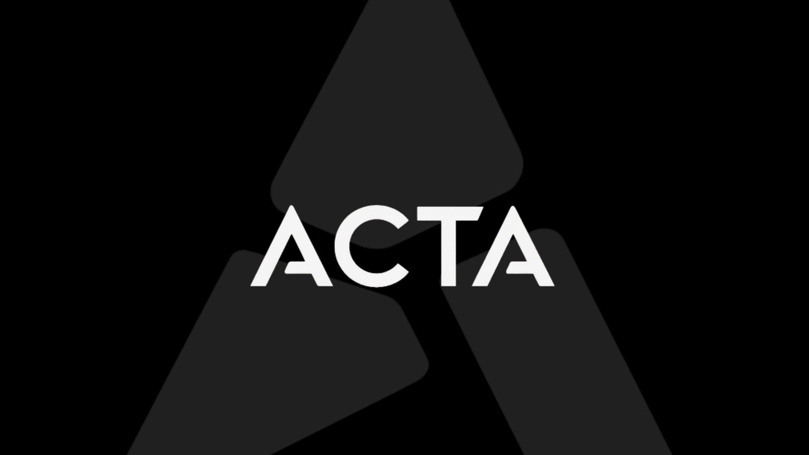
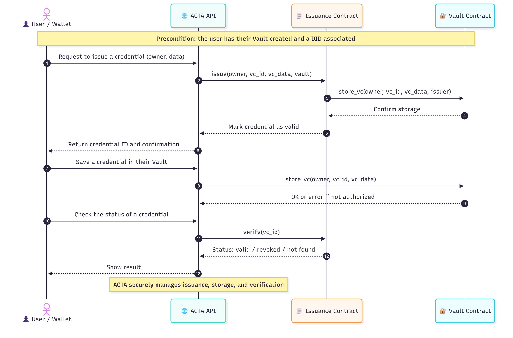

# ACTA — Official Documentation

ACTA is a Verifiable Credentials API built on the Stellar network (Soroban) that enables startups, DAOs, and companies to issue and verify trusted digital credentials. Our vision is to make trust in digital records as seamless and transparent as a blockchain transaction.

## What is ACTA

- API + smart contracts to issue, store, and verify W3C Verifiable Credentials.
- Hash anchored on-chain; VC data off-chain and/or encrypted.
- Public verification with minimal latency; no PII stored on-chain.
- “Zero‑database” architecture: your app can be stateless and store only `vc_id`.

## How it Works

1. The issuer requests to issue a credential (`vc_id`, `vc_data`).
2. The Issuance contract marks status and stores the VC in the owner’s Vault contract.
3. The app keeps the `vc_id` and can read/verify whenever needed.

## Base URL

`https://api.acta.build`

Before using the API, create the owner’s Vault and DID at `https://demo.acta.build`. The Vault is required for on‑chain storage, and the DID associates ownership per W3C standards.

## Scope of this Documentation

- Exact public endpoints with request/response payloads.
- Smart contracts reference: Issuance and Vault (functions and rules).
- W3C VC and DID alignment, plus security notes.

## Technical Summary

- Soroban contracts:
  - `acta_issuance_contract`: `issue`, `verify`, `revoke`, admin operations.
  - `acta_vault_contract`: per‑owner storage; issuer authorization; reads.
- TypeScript service: transaction signing, Horizon/Soroban RPC calls, REST exposure.
- VC status: `valid`, `revoked` (with date), or `invalid`.

## SCF#40 — Abstract (condensed)

ACTA is a Verifiable Credentials API built on Stellar that abstracts blockchain complexity. Each credential is hashed and anchored on‑chain, while metadata and proofs are accessible via our API. This hybrid approach ensures scalability, low cost, and interoperability. The MVP runs on testnet; mainnet deployment follows security and performance reviews. See links below for more.

## Resources

- Website: `https://acta.build`
- GitHub: `https://github.com/ACTA-Team`
- Analytics: `https://us.posthog.com/shared/Hsleyk7g3zP5ny1eEoB4h0viBONr_w`
- X/Twitter: `https://x.com/ActaXyz`
- LinkedIn: `https://www.linkedin.com/company/acta-org/`

## Next Steps

Go to “API Reference” for endpoints and to “Smart Contracts” for Issuance and Vault details.
