# 🌟 ACTA API Documentation

<div align="center">


**🚀 Complete Documentation for Stellar Verifiable Credentials Management API**

*A robust and secure REST API for creating, managing, and verifying verifiable credentials using Stellar blockchain and Soroban smart contracts.*

</div>

---

## 📚 Table of Contents

This documentation is organized into the following sections:

| Section | Description | Status |
|---------|-------------|--------|
| 📖 **[Introduction](./01-introduction.md)** | Overview of the ACTA API, architecture, and core concepts | ✅ Complete |
| ⚙️ **[Setup and Installation](./02-setup.md)** | Complete setup guide for development and testing | ✅ Complete |
| 🔐 **[Authentication and Security](./03-authentication.md)** | Security implementation and best practices | ✅ Complete |
| 🌐 **[API Endpoints](./04-endpoints.md)** | Detailed reference for all API endpoints | ✅ Complete |
| 🔧 **[Services](./05-services.md)** | Core services and business logic documentation | ✅ Complete |
| ⚙️ **[Configuration](./06-configuration.md)** | Environment variables and configuration options | ✅ Complete |
| 💡 **[Examples and Use Cases](./07-examples.md)** | Practical examples and integration patterns | ✅ Complete |
| 🚀 **[Deployment Guide](./08-deployment.md)** | Production deployment and infrastructure setup | ✅ Complete |
| 🔍 **[Troubleshooting and FAQ](./09-troubleshooting.md)** | Common issues and solutions | ✅ Complete |

## 🚀 Quick Start

<div align="center">

### Get up and running in 3 simple steps!

</div>

### 1️⃣ **Clone and Setup**
```bash
git clone <repository-url>
cd acta-api
cp .env.example .env
```

### 2️⃣ **Configure Environment**
Edit `.env` with your Stellar network configuration:
```bash
# Required: Your Stellar secret key
STELLAR_SECRET_KEY=your_stellar_secret_key_here

# Network configuration (testnet/mainnet)
STELLAR_NETWORK=testnet
STELLAR_HORIZON_URL=https://horizon-testnet.stellar.org
```

### 3️⃣ **Install and Run**
```bash
npm install
npm run dev
```

### 🎯 **Test the API**
```bash
# Health check
curl https://acta.up.railway.app/health

# Or locally
curl http://localhost:8000/health
```

<div align="center">

🎉 **Congratulations!** Your ACTA API is now running!

</div>

## 🏗️ Architecture Overview

<div align="center">

### The ACTA API follows a modular architecture with clear separation of concerns

```mermaid
graph TB
    A[🌐 Client Applications] --> B[🔒 ACTA API Gateway]
    B --> C[🔧 Business Logic Layer]
    C --> D[💾 Database Service]
    C --> E[⭐ Stellar Network]
    
    subgraph "Client Layer"
        A1[Web Apps]
        A2[Mobile Apps] 
        A3[dApps]
    end
    
    subgraph "API Layer"
        B1[🛡️ Security Middleware]
        B2[📝 Validation Layer]
        B3[🌐 REST Endpoints]
    end
    
    subgraph "Service Layer"
        C1[🔐 Credential Service]
        C2[⭐ Stellar Service]
        C3[💾 Database Service]
    end
    
    subgraph "Infrastructure"
        D1[📊 Supabase Database]
        E1[🌟 Stellar Horizon]
        E2[🤖 Soroban Contracts]
    end
```

</div>



### 🔧 **Core Components**

| Component | Technology | Purpose |
|-----------|------------|----------|
| 🚀 **Express.js Server** | Node.js + TypeScript | High-performance web server with type safety |
| ⭐ **Stellar SDK Integration** | @stellar/stellar-sdk | Direct blockchain interaction and transaction handling |
| 🤖 **Soroban Smart Contracts** | Rust + Soroban | On-chain business logic execution |
| 🛡️ **Security Layer** | Helmet + CORS | Comprehensive security headers and access control |
| 💾 **Database Layer** | Supabase PostgreSQL | Persistent data storage with encryption |

## 🆘 Getting Help

<div align="center">

### Need assistance? We've got you covered!

</div>

| Resource | Description | Link |
|----------|-------------|------|
| 📖 **Documentation** | Start with comprehensive overview | [Introduction](./01-introduction.md) |
| 💡 **Examples** | Practical implementations and patterns | [Examples and Use Cases](./07-examples.md) |
| 🔍 **Troubleshooting** | Common issues and solutions | [Troubleshooting and FAQ](./09-troubleshooting.md) |
| 🌐 **Online Docs** | Latest version and updates | [https://acta.gitbook.io/docs](https://acta.gitbook.io/docs) |
| 💬 **Support** | Direct assistance from our team | Contact development team |

---

<div align="center">

### 🔗 **Useful Links**

[](https://developers.stellar.org/)
[](https://soroban.stellar.org/)
[](https://github.com/your-org/acta-api)
[](https://acta.gitbook.io/docs)

</div>

---

<div align="center">

*This documentation is maintained by the ACTA development team and is regularly updated to reflect the latest API changes and best practices.*

**Version 1.0.0** | **Last Updated: January 2025** | **Status: ✅ Active**

</div>

**Current Version**: 1.0.0  
**Last Updated**: January 2024  
**API Compatibility**: Stellar Mainnet & Testnet

---

*This documentation is designed for developers who want to integrate or contribute to the ACTA ecosystem.*